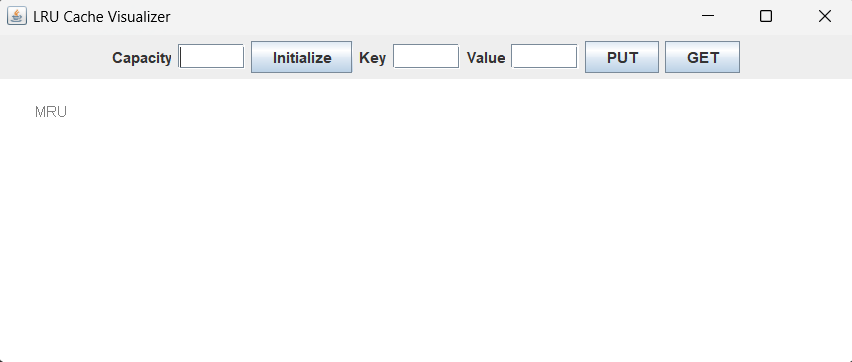
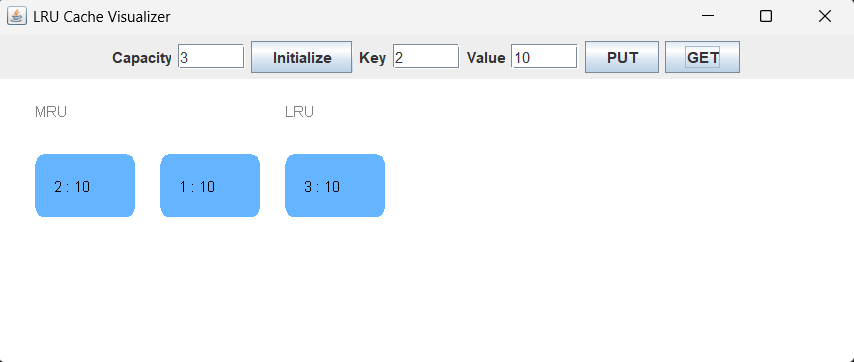

# LRU Cache Visualizer (Java)

An interactive **LRU (Least Recently Used) Cache Visualizer** built using Java Swing.
This project demonstrates how LRU caching works internally using **HashMap + Doubly Linked List** with animated colored blocks.

---

## Preview

### LRU Cache Interface

### Cache Animation

---

## Features

* O(1) GET and PUT operations
* HashMap + Doubly Linked List implementation
* Animated colored cache blocks
* MRU → LRU visualization
* Automatic eviction of least recently used item
* Interactive GUI
* Real-time cache updates

---

## Technologies Used

* Java
* Swing (GUI)
* HashMap
* Doubly Linked List
* OOP

---

## How It Works

* Most Recently Used items move to front
* Least Recently Used items move to end
* When capacity is full, last item is removed
* GUI updates with animation

Example:

Capacity = 3

PUT 1
PUT 2
PUT 3

Cache:
[3] [2] [1]

GET 1

Cache:
[1] [3] [2]

PUT 4

Cache:
[4] [1] [3]

---

## How to Run

Compile:
javac LRUCacheVisualizer.java

Run:
java LRUCacheVisualizer

---

## Project Structure

LRU-Cache-Visualizer
│
├── LRUCacheVisualizer.java
├── Screenshot1.png
├── Screenshot2.png
└── README.md

---

## Author

**Sujal Chouksey**
GitHub: https://github.com/sujal-09

---

## License

This project is open-source and available for learning purposes.
